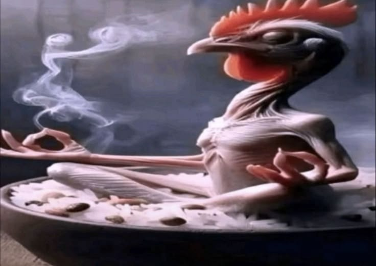

R
  
  You're overreacting and making things worse ?
  
  Are you trying to attract more haters for me? 🥶🙌💥💥
  
Oh my god, I'm trembling with fear of you! 🥺🥺🥺😱😱😱😱😍😍😍😍🥶🥶

Why not just forget about it and live a normal life instead of constantly making a fool of yourself or causing a bigger fuss? 🙌💥

Are you feeling down? I'm not betraying my current friends; I'm still making them happy and helping them have better lives🥶🥺🙄

Focus on your studies, don't cause any more trouble just to attract attention and make more people hate me, dumbass 😢🫢🥺

Don't get angry like a madwoman when I say that, I'm trembling~~😍😍🥶

Do you like me😍💥🤯🤫? Why do you keep bringing that up and making a big deal out of it? 🥶🙌

I laughed out loud !!!!😳😳💥💥💥💥🥶🥶

So what now? I'm living better! I care more about my friends, builds trust and earns more people's affection, And I don't joke excessively in a way that makes them as uncomfortable as you do, Augh 🥶😱😍💥🤩🤑😂

Focus on the present, Bringing up the past just to attract haters for me? Thanks! but I don't need it~❤️‍🔥❤️‍🔥❤️‍🔥❤️‍🔥🤑🤑🤑🥶🥶

Ok, And don't drag her into this, ok? That's amazing, Even my friends don't like your attitude. Do you really think you haven't done anything wrong, huhh? The joke was so excessive that it made people uncomfortable, So when someone else points it out, you get angry and walk away? omg~ Many of my friends don't even like you, haiz~ And don't try to cause trouble, make things worse, or turn it into a big problem, nobody will bother you then 🤡

